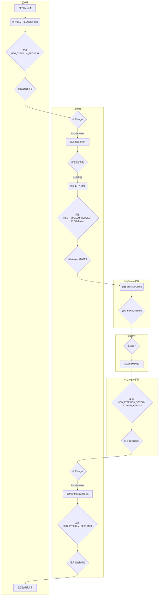
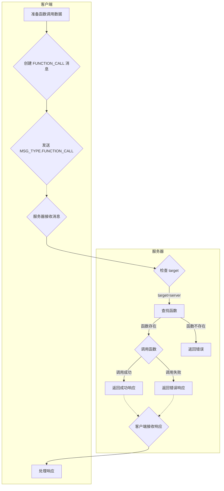

# SillyTavern-NewAge 扩展端开发文档

本文档旨在帮助开发者理解 SillyTavern-NewAge 扩展的扩展端（运行在 SillyTavern 环境中）代码结构、API 和开发流程。

## 目录

- [SillyTavern-NewAge 扩展端开发文档](#sillytavern-newage-扩展端开发文档)
  - [目录](#目录)
  - [文件结构](#文件结构)
  - [初始化流程](#初始化流程)
  - [模块和函数](#模块和函数)
  - [`index_NewAge.js`](#index_newagejs)
    - [1. 全局变量和常量](#1-全局变量和常量)
    - [2. 日志管理](#2-日志管理)
    - [3. 连接管理](#3-连接管理)
    - [4. 消息处理](#4-消息处理)
    - [5. UI 更新](#5-ui-更新)
    - [6. 客户端密钥管理](#6-客户端密钥管理)
    - [7. 辅助函数](#7-辅助函数)
    - [8. 弃用的函数](#8-弃用的函数)
  - [`message_forwarder.js`](#message_forwarderjs)
  - [`Rooms.js`](#roomsjs)
  - [事件监听](#事件监听)
  - [流程图](#流程图)
    - [登录与密钥获取流程](#登录与密钥获取流程)
    - [LLM 文本生成流程](#llm-文本生成流程)
    - [Function Call 流程](#function-call-流程)
  - [开发指南](#开发指南)
  - [注意事项](#注意事项)

## 文件结构

```
SillyTavern-NewAge/ (扩展根目录)
├── dist/
│   └── iframe_server/ (前端助手代码，已复制到此)
│       ├── ...
│       └── index.js
├── lib/
│   ├── constants.js      (常量定义)
│   ├── non_stream.js    (非流式消息处理)
│   ├── Rooms.js           (房间管理)
│   ├── stream.js       (流式消息处理)
│   └── uuid.js       (UUID 生成)
├── index_NewAge.html     (扩展设置界面)
├── index_NewAge.js      (扩展主入口)
└── style.css         (扩展样式)
```

## 初始化流程

1.  **加载 HTML 和 CSS**: SillyTavern 加载扩展的 `index_NewAge.html` 和 `style.css`。
2.  **执行 JavaScript**:
    *   导入必要的模块和函数。
    *   定义全局变量。
    *   定义辅助函数。
    *   调用前端助手的所有注册函数。
    *   监听 `window` 的 `message` 事件，调用 `handleIframe` 处理来自 iframe 的消息。
    *   设置初始 UI 状态（隐藏部分元素）。
    *   自动填充扩展识别名称和端口号。
    *   调用 `loadSettings()` 加载服务器设置。
3.  **用户登录** (可选):
    *   如果服务器设置了密码，用户需要输入密码才能连接。
    *   点击“登录”按钮，触发 `onLoginClick` 事件。
    *   向服务器发送 `MSG_TYPE.LOGIN` 消息进行验证。
    *   验证成功后，隐藏登录表单，显示连接按钮和其他 UI 元素，并自动调用 `connectToServer()`。
4.  **连接到服务器**:
    *   `connectToServer()` 函数：
        *   获取服务器地址和端口。
        *   生成客户端 ID (`clientId`)。
        *   创建 Socket.IO 连接，并在 `auth` 对象中传递 `clientType`、`clientId` 和 `desc`。
        *   设置 `setupSocketListeners()` 监听 Socket.IO 事件。
        *   连接成功后：
            *   调用 `getOrCreateClientKey()` 获取或生成客户端密钥。
            *   更新 `socket.auth` 对象，添加 `key`。
            *   调用 `sendMasterKey()` 发送主密钥（如果存在）。
            *   调用 `refreshRoomList()` 和 `updateClientList()`。

## 模块和函数

## `index_NewAge.js` 

### 1. 全局变量和常量

| 变量名                | 类型                                        | 描述                              |
| :-------------------- | :------------------------------------------ | :-------------------------------- |
| `extensionName`       | `string`                                    | 扩展名称 ("SillyTavern-NewAge")。 |
| `extensionFolderPath` | `string`                                    | 扩展文件夹路径。                  |
| `socket`              | `Socket` (Socket.IO 客户端实例)             | 与服务器的 Socket.IO 连接。       |
| `streamBuffer`        | `string[]`                                  | 用于存储流式数据的缓冲区。        |
| `isStreaming`         | `boolean`                                   | 标记当前是否正在接收流。          |
| `logCounter`          | `number`                                    | 日志计数器。                      |
| `llmRequestQueue`     | `Array<{data: object, callback: Function}>` | 存储待处理的 LLM 请求队列         |
| `functionCallQueue`   | `Array`                                     | 存储待处理的函数调用请求队列。    |
| `isProcessingRequest` | `boolean`                                   | 标志：是否有请求正在处理中。      |
| `clientId`            | `string`                                    | 客户端 ID。                       |

### 2. 日志管理

| 函数名          | 描述                                               | 参数                                                                                                                                                             | 返回值 |
| :-------------- | :------------------------------------------------- | :--------------------------------------------------------------------------------------------------------------------------------------------------------------- | :----- |
| `addLogMessage` | 向日志表格添加一条日志消息。                       | `type`: 日志类型 (success, warning, fail, info)<br>`message`: 日志消息<br>`source`: 消息来源 (可选)<br>`requestId`: 请求 ID (可选)<br>`outputId`: 输出 ID (可选) | 无     |
| `filterLog`     | 根据选择的类型（或来源）过滤日志表格中的日志消息。 | 无                                                                                                                                                               | 无     |

### 3. 连接管理

| 函数名                 | 描述                                                                                              | 参数 | 返回值          |
| :--------------------- | :------------------------------------------------------------------------------------------------ | :--- | :-------------- |
| `connectToServer`      | 连接到 Socket.IO 服务器，设置 `socket` 对象，发送客户端信息，处理连接成功后的逻辑，设置监听事件。 | 无   | `Promise<void>` |
| `onConnectClick`       | 处理“连接”按钮点击事件, 调用 `connectToServer()`。                                                | 无   | 无              |
| `onDisconnectClick`    | 处理“断开连接”按钮点击事件，断开与服务器的连接。                                                  | 无   | 无              |
| `setupSocketListeners` | 设置 Socket.IO 事件监听器。                                                                       | 无   | 无              |

### 4. 消息处理

| 函数名              | 描述                                                                       | 参数                                                       | 返回值          |
| :------------------ | :------------------------------------------------------------------------- | :--------------------------------------------------------- | :-------------- |
| `handleStreamToken` | 处理接收到的流式 Token。                                                   | `data`: 接收到的数据                                       | 无              |
| `handleLlmRequest`  | 处理 LLM 请求。将请求添加到 `llmRequestQueue`，并调用 `processRequest()`。 | `data`: 请求数据 (包含 `message`、`requestId`、`outputId`) | `Promise<void>` |
| `processRequest`    | 按顺序处理请求队列中的请求.                                                |                                                            | `Promise<void>` |

### 5. UI 更新

| 函数名                                | 描述                                                | 参数                      | 返回值          |
| :------------------------------------ | :-------------------------------------------------- | :------------------------ | :-------------- |
| `updateButtonState(isConnected)`      | 更新连接/断开连接按钮的状态。                       | `isConnected`: 是否已连接 | 无              |
| `updateClientList(clients)`           | 更新客户端列表。                                    | `clients`:客户端列表      | 无              |
| `updateForwardingOptionsVisibility()` | 更新消息转发选项（流式/非流式）的可见性。           | 无                        | 无              |
| `checkAndHandleMutex()`               | 检查并处理流式/非流式转发互斥情况（不能同时启用）。 | 无                        | `boolean`       |
| `displayRoomList(rooms)`              | 将房间列表渲染到页面上                              | `rooms` 房间列表          | 无              |
| `displayRoomDetails`                  | 获取并显示房间内的客户端                            | `roomName` 房间名         | `Promise<void>` |
| `refreshRoomList()`                   | 从服务器获取房间列表并更新 UI。                     | 无                        | `Promise<void>` |
| `updateDeleteRoomSelect(rooms)`       | (已弃用)更新可删除房间的下拉菜单。                  | `rooms`: 房间列表         | 无              |

### 6. 客户端密钥管理

| 函数名                          | 描述                       | 参数 | 返回值            |
| :------------------------------ | :------------------------- | :--- | :---------------- |
| `getOrCreateClientKey()`        | 获取或生成客户端密钥。     | 无   | `Promise<string>` |
| `generateAndDisplayClientKey()` | 生成并显示客户端密钥。     | 无   | `Promise<void>`   |
| `copyClientKey()`               | 将客户端密钥复制到剪贴板。 | 无   | 无                |
| `removeClientKey()`             | 移除选定客户端的密钥。     | 无   | 无                |

### 7. 辅助函数

| 函数名                 | 描述                            | 参数 | 返回值          |
| :--------------------- | :------------------------------ | :--- | :-------------- |
| `getSillyTavernPort()` | 获取 SillyTavern 实例的端口号。 | 无   | `string`        |
| `generateClientId()`   | 生成客户端 ID。                 | 无   | `string`        |
| `sendMasterKey()`      | 发送主密钥 (如果存在)。         | 无   | 无              |
| `onLoginClick()`       | 处理登录事件,                   | 无   | `Promise<void>` |
| `onTestClick`          | 触发测试事件.                   | 无   | 无              |
| `testGenerate`         | 测试文本生成。                  | 无   | `Promise<void>` |
| `loadSettings`         | 加载服务器配置                  | 无   | `Promise<void>` |
| `saveSettings`         | 保存服务器配置                  | 无   | `Promise<void>` |

### 8. 弃用的函数
* `updateDeleteRoomSelect`

---

## `message_forwarder.js`

| 函数名                         | 描述                                         | 参数                                                                                                                                     | 返回值           |
| :----------------------------- | :------------------------------------------- | :--------------------------------------------------------------------------------------------------------------------------------------- | :--------------- |
| `getMessageType()`             | 获取消息类型（流式或非流式）。               | 无                                                                                                                                       | `number`         |
| `handleNonStreamMessage()`     | 处理非流式消息。                             | `messageId`: 消息 ID, `messageType`: 消息类型, `extensionName`: 扩展名称                                                                 | 无               |
| `handleStreamToken()`          | 处理流式 token。                             | `data`: 接收到的 token 数据, `messageType`: 消息类型, `extensionName`: 扩展名称                                                          | 无               |
| `startStreamFromStream()`      | 从流式数据启动新的流式传输（用于流式转发）。 | `socket`: Socket.IO Socket 实例, `newData`: 新的流数据, `outputId`: 输出 ID, `previousLength`: 之前数据的长度, `extensionName`: 扩展名称 | 无               |
| `startStreamFromNonStream()`   | 从非流式消息启动新的流式传输。               | `socket`: Socket.IO Socket 实例, `message`: 非流式消息, `numStreams`: 分块数量, `extensionName`: 扩展名称                                | 无               |
| `accumulateStreamData()`       | 累积流式数据。                               | `data`: 要累积的数据                                                                                                                     | 无               |
| `sendAccumulatedData()`        | 发送累积的流式数据。                         | 无                                                                                                                                       | 无               |
| `enableStreamForwarding()`     | 启用流式转发。                               | 无                                                                                                                                       | 无               |
| `disableStreamForwarding()`    | 禁用流式转发。                               | 无                                                                                                                                       | 无               |
| `enableNonStreamForwarding()`  | 启用非流式转发。                             | 无                                                                                                                                       | 无               |
| `disableNonStreamForwarding()` | 禁用非流式转发。                             | 无                                                                                                                                       | 无               |
| `getCurrentOutputId`           | 获取当前outputID                             | 无                                                                                                                                       | `string`或`null` |
| `setNewOutputId`               | 设置新的outputID和请求ID                     | 无                                                                                                                                       | 无               |
| `resetOutputId`                | 重置当前outputID和请求ID                     | 无                                                                                                                                       | 无               |
| `resetPreviousLLMData`         | 重置`previousLLMData`                        | 无                                                                                                                                       | 无               |
| `isStreamForwardingEnabled`    | 判断是否启用了流式转发                       | 无                                                                                                                                       | `boolean`        |
| `isNonStreamForwardingEnabled` | 判断是否启用了非流式转发                     | 无                                                                                                                                       | `boolean`        |

## `Rooms.js`

| 函数名                 | 描述                               | 参数                                                                | 返回值             |
| ---------------------- | :--------------------------------- | :------------------------------------------------------------------ | :----------------- |
| `createRoom`           | 创建房间（仅限扩展）。             | `extensionId`: 扩展 ID, `roomName`: 房间名称                        | `Promise<boolean>` |
| `deleteRoom`           | 删除房间（仅限扩展）。             | `extensionId`: 扩展 ID, `roomName`: 房间名称                        | `Promise<boolean>` |
| `addClientToRoom`      | 将客户端添加到房间（由扩展调用）。 | `extensionId`: 扩展 ID, `clientId`: 客户端 ID, `roomName`: 房间名称 | `Promise<boolean>` |
| `removeClientFromRoom` | 将客户端从房间移除。               | `clientId`: 客户端 ID, `roomName`: 房间名称                         | `Promise<boolean>` |
| `getExtensionRooms`    | 获取指定扩展的房间列表。           | `extensionId`: 扩展 ID                                              | `string[]`         |
| `getAllRooms`          | 获取所有房间                       | 无                                                                  | `string[]`         |
| `setClientDescription` | 设置客户端描述。                   | `clientId`: 客户端 ID, `description`: 描述                          | 无                 |
| `getClientDescription` | 获取客户端描述。                   | `clientId`: 客户端 ID                                               | `string` \| `null` |

## 事件监听
* SillyTavern事件
  *   `eventSource.on(event_types.STREAM_TOKEN_RECEIVED, ...)`: 监听流式 token。
    *   `eventSource.on(event_types.MESSAGE_RECEIVED, ...)`: 监听新消息。
    *   `eventSource.on(event_types.GENERATION_STARTED, ...)`: 监听生成开始事件。
    *   `eventSource.on(event_types.GENERATION_ENDED, ...)`: 监听生成结束事件。
    *   `eventSource.on(event_types.GENERATION_STOPPED, ...)`: 监听生成停止事件。
  *  `eventSource.on('js_generation_ended', ...)`: 监听生成结束事件（来自前端助手）。

*   Socket.IO 事件
    *   `socket.on('connect', ...)`: 监听连接建立事件。
    *   `socket.on('message', ...)`: 监听非流式消息。
    *   `socket.on(STREAM_EVENTS.START_RESPONSE, ...)`: 监听流式传输开始事件。
    *   `socket.on(STREAM_EVENTS.DATA_FIRST_RESPONSE, ...)`: 监听流式传输首个数据块。
    *   `socket.on(STREAM_EVENTS.DATA_MIDDLE_RESPONSE, ...)`: 监听流式传输中间数据块。
    *   `socket.on(STREAM_EVENTS.DATA_LAST_RESPONSE, ...)`: 监听流式传输最后一个数据块。
    *   `socket.on(STREAM_EVENTS.DATA_RETRY_RESPONSE, ...)`: 监听流式传输重试事件。
    *   `socket.on(STREAM_EVENTS.DATA_FAILED_RESPONSE, ...)`: 监听流式传输失败事件。
    *   `socket.on(STREAM_EVENTS.END_RESPONSE, ...)`: 监听流式传输结束事件。
    *   `socket.on(MSG_TYPE.LLM_REQUEST, ...)`: 监听 LLM 请求。
    *   `socket.on(MSG_TYPE.LLM_RESPONSE, ...)`: 监听 LLM 响应。
    *   `socket.on('disconnect', ...)`: 监听断开连接事件。
    *   `socket.on('connect_error', ...)`: 监听连接错误事件。
    *   `socket.on('reconnect_failed', ...)`: 监听重连失败事件。

*   UI 事件
    *   `$('#socketio-disconnectBtn').on('click', ...)`: 监听断开连接按钮点击事件。
    *   `$('#socketio-testBtn').on('click', ...)`: 监听测试连接按钮点击事件。
    *   `$('#socketio-saveSettingsBtn').on('click', ...)`: 监听保存设置按钮点击事件。
    *   `$('#socketio-logFilter').on('change', ...)`: 监听日志过滤器更改事件。
    *   `$('#socketio-createRoomBtn').on('click', ...)`: 监听创建房间按钮点击事件。
    *   `$('#socketio-refreshRoomsBtn').on('click', ...)`: 监听刷新房间列表按钮点击事件。
    *   `$('#socketio-deleteRoomBtn').on('click', ...)`: 监听删除房间按钮点击事件。
    *   `$('#socketio-loginBtn').on('click', ...)`: 监听登录按钮点击事件。
    *   `$('#socketio-defaultForwarding').on('change', ...)`: 监听默认转发行为复选框更改事件。
    *   `$('#stream_toggle').on('change', ...)`: 监听流式传输开关更改事件。
    *   `$('#socketio-enableStream').on('change', ...)`: 监听启用流式转发复选框更改事件。
    *   `$('#socketio-enableNonStream').on('change', ...)`: 监听启用非流式转发复选框更改事件。
    *   `$('.details-btn').on('click', ...)`: 监听房间详情按钮点击事件。
    *   `$('.leave-btn').on('click', ...)`: 监听离开房间按钮点击事件。
    *   `$('#socketio-generateKeyBtn').on('click', ...)`: 监听生成密钥按钮点击事件。
    *   `$('#socketio-copyKeyBtn').on('click', ...)`: 监听复制密钥按钮点击事件。
    *   `$('#socketio-removeKeyBtn').on('click', ...)`: 监听移除密钥按钮点击事件。

## 流程图

### 登录与密钥获取流程

```mermaid
graph TD
    subgraph 客户端(index_NewAge.js)
        A[用户输入密码] --> B(点击登录按钮)
        B --> C{发送 MSG_TYPE.LOGIN}
    end

    subgraph 服务器(server.js)
        C -- 密码 --> D{验证密码}
        D -- 密码正确 --> E[返回成功响应]
        D -- 密码错误 --> F[返回错误响应]
    end

    C -.-> G{接收响应}
    subgraph 客户端(index_NewAge.js)
    G -- 登录成功 --> H(隐藏登录表单, 显示其他UI)
    G -- 登录成功 --> I(调用 connectToServer)
    I --> J{创建 Socket.IO 连接}
    J -- 包含客户端信息 --> K(发送到服务器)
    K -.-> L{服务器验证}

    subgraph 服务器(server.js)
      L -- 验证通过 --> M[接收并存储客户端信息]
      L -- 验证失败 --> N[断开连接]
    end
     subgraph 客户端(index_NewAge.js)
        K --> O{发送 MSG_TYPE.GET_CLIENT_KEY}
        O -.-> P{接收响应}
        P -- 有密钥 --> Q[使用服务器返回的密钥]
        P -- 无密钥 --> R{发送 MSG_TYPE.GENERATE_CLIENT_KEY}
        R -.-> S{接收响应}
        S -- 生成成功 --> T[使用新生成的密钥]
        S -- 生成失败 --> U[显示错误信息]
     end

    subgraph 服务器(server.js)
        O --> V{检查客户端密钥}
        V -- 有密钥 --> W[返回密钥]
        V -- 无密钥 --> X{接收 MSG_TYPE.GENERATE_CLIENT_KEY}
        X --> Y[生成并存储密钥]
        Y --> Z[返回新密钥]
    end
    end
```

### LLM 文本生成流程


### Function Call 流程

## 开发指南
1. **消息格式**:
  * 客户端和服务器之间的所有消息都应该遵循以下基本格式：
```json
    {
        "type": "消息类型 (参考 MSG_TYPE)",
        "requestId": "唯一请求 ID (UUID)",
        "target": "消息目标 ('server' 或 客户端 ID/房间名)",
        "source": "消息来源 (客户端 ID 或 'server')",
        "...": "其他数据 (根据消息类型而定)"
    }
```
2. **function_call 消息格式**:
```json
   {
    "requestId": "5d8c63f9-1c69-478b-8f57-75d8b3d2f123",
    "functionName": "save_json",
    "args": [
        "path/to/file.json",
        {
            "key1": "value1",
            "key2": 123
        }
    ],
    "target": "server"
   }
```
3. **流式消息**:
    *   使用 `STREAM_EVENTS` 中的事件名称来发送和接收流式消息。
    *   `STREAM_START` 消息应该包含 `streamId`、`outputId` 和 `numStreams` 字段。
    *   `STREAM_DATA_FIRST`、`STREAM_DATA_MIDDLE`、`STREAM_DATA_LAST` 消息应该包含 `streamId`、`outputId`、`chunkIndex` 和 `data` 字段。
    *   `STREAM_END` 消息应该包含 `streamId` 和 `outputId` 字段。
    *   服务器会为每个事件名称添加 `_RESPONSE` 后缀，例如 `STREAM_START` 对应 `STREAM_START_RESPONSE`。
4. **房间管理**:
    *   使用 `createRoom`、`deleteRoom`、`addClientToRoom` 和 `removeClientFromRoom` 函数来管理房间。
    *   房间名通常与客户端 ID 相同。
    *   只有 SillyTavern 扩展可以创建和删除房间。
5. **密钥管理**:
   *   使用 `generateAndStoreClientKey` 生成客户端密钥，`removeClientKey` 移除客户端密钥。
   *   密钥会自动哈希存储。
   *    只有 SillyTavern 扩展可以生成和移除客户端密钥。
6. **错误处理**:
    *   在 `socket.on` 监听器中，使用 `try...catch` 块来捕获错误。
    *   向客户端发送错误消息时，使用 `MSG_TYPE.ERROR` 类型。
    *   在错误消息中包含 `message` 字段来描述错误。
7. **事件命名**:
   * 自定义的事件应避免和`STREAM_EVENTS`以及SillyTavern提供的事件命名冲突.

## 注意事项
* 扩展端运行在SillyTavern的iframe中, 和SillyTavern主程序同源.
* 扩展端的大部分function都不是全局函数, 需要通过import的方式进行调用.
* 扩展端可以通过SillyTavern提供的一些变量和event来进行操作, 具体请参考SillyTavern的文档.
* 注意异步操作, 比如`socket.emit`的回调, 以及`Promise`.
* 注意`message_forwarder.js`的消息转发机制.
* 注意`index_NewAge.js`的`processRequest()`请求队列.
* 注意房间的概念, 以及SillyTavern扩展的权限.
* 注意错误处理, 特别是和服务器的通信.
* 注意`socket.handshake.auth`中的内容.
* 注意`setupSocketListeners()`中的事件监听, 确保理解每个事件的触发时机和数据格式.
* 注意安全性, 尤其是密钥和密码的处理.
* 注意代码的可读性和可维护性.

希望这份开发文档能够帮助你更好地理解和使用 SillyTavern-NewAge 扩展！
