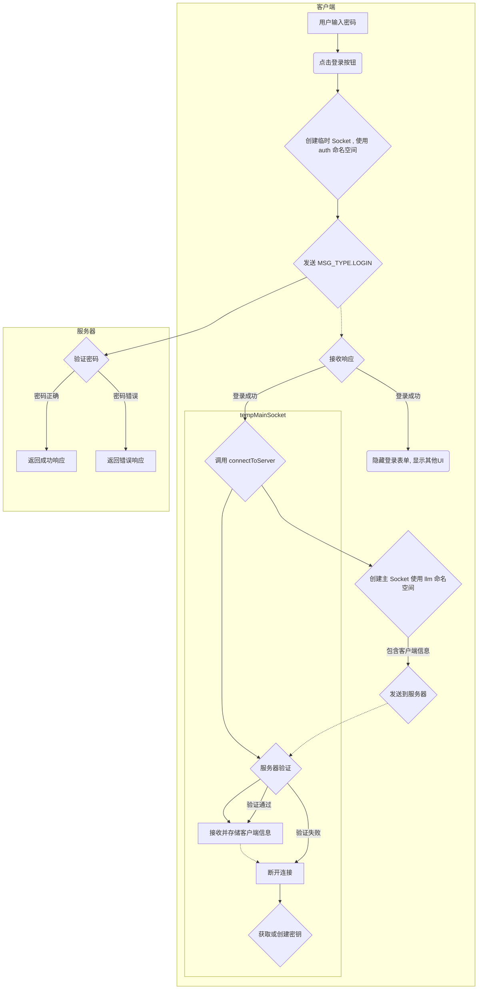
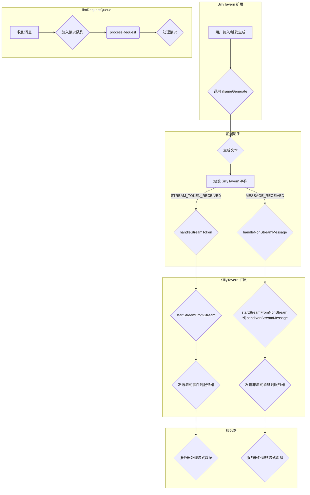
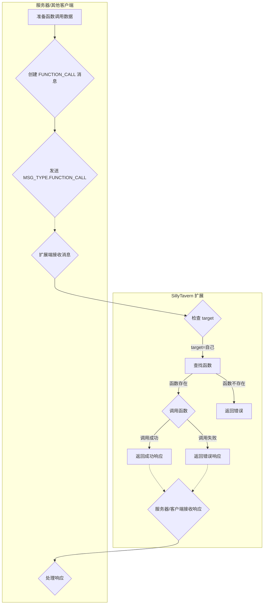

# SillyTavern-NewAge 扩展端开发文档

本文档旨在帮助开发者理解 SillyTavern-NewAge 扩展的扩展端（运行在 SillyTavern 环境中）代码结构、API 和开发流程。

## 目录

- [SillyTavern-NewAge 扩展端开发文档](#sillytavern-newage-扩展端开发文档)
  - [目录](#目录)
  - [文件结构](#文件结构)
  - [初始化流程](#初始化流程)
  - [模块和函数](#模块和函数)
  - [`index_NewAge.js`](#index_newagejs)
    - [1. 全局变量和常量](#1-全局变量和常量)
    - [2. 日志管理](#2-日志管理)
    - [3. 连接管理](#3-连接管理)
    - [4. 消息处理](#4-消息处理)
    - [5. UI 更新](#5-ui-更新)
    - [6. 客户端密钥管理](#6-客户端密钥管理)
    - [7. 辅助函数](#7-辅助函数)
    - [8. 弃用的函数](#8-弃用的函数)
  - [`message_forwarder.js`](#message_forwarderjs)
    - [1. 消息转发](#1-消息转发)
    - [2. 辅助函数](#2-辅助函数)
  - [`Rooms.js`](#roomsjs)
  - [事件监听](#事件监听)
  - [流程图](#流程图)
    - [登录与密钥获取流程](#登录与密钥获取流程)
    - [LLM 文本生成流程](#llm-文本生成流程)
    - [Function Call 流程](#function-call-流程)
  - [开发指南](#开发指南)
  - [注意事项](#注意事项)

## 文件结构

```
SillyTavern-NewAge/ (扩展根目录)
├── dist/
│   └── iframe_server/ (前端助手代码，已复制到此)
│       ├── ...
│       └── index.js
├── lib/
│   ├── constants.js      (常量定义)
│   ├── Socket.io       (Socket.IO 客户端库)
│   ├── non_stream.js    (非流式消息处理)
│   ├── stream.js       (流式消息处理, 已弃用)
│   └── uuid.js          (UUID 生成)
├── index_NewAge.html     (扩展设置界面)
├── index_NewAge.js      (扩展主入口)
└── style.css         (扩展样式)
```

## 初始化流程

1.  **加载 HTML 和 CSS**: SillyTavern 加载扩展的 `index_NewAge.html` 和 `style.css`。
2.  **执行 JavaScript**:
    *   导入必要的模块和函数。
    *   定义全局变量。
    *   定义辅助函数。
    *   调用前端助手的所有注册函数。
    *   监听 `window` 的 `message` 事件，调用 `handleIframe` 处理来自 iframe 的消息 (用于与前端助手集成)。
    *   设置初始 UI 状态 (隐藏部分元素)。
    *   自动填充扩展识别名称和端口号。
    *   调用 `checkRememberMe()` 检查是否记住了登录。
        *   如果记住了登录，则自动调用 `connectToServer()` 连接到服务器。
        *   否则，显示登录表单。

3.  **用户登录** (可选):
    *   如果服务器设置了密码，并且用户没有选择 "记住我"，则需要输入密码才能连接。
    *   点击“登录”按钮，触发 `onLoginClick` 事件。
    *   创建一个临时的 Socket.IO 连接 (到 `/auth` 命名空间)，用于发送 `MSG_TYPE.LOGIN` 消息进行验证。
    *   验证成功后，隐藏登录表单，显示连接按钮和其他 UI 元素，并自动调用 `connectToServer()`。

4.  **连接到服务器**:
    *   `connectToServer()` 函数：
        *   获取服务器地址和端口 (从 UI 或已保存的设置中)。
        *   生成客户端 ID (`clientId`)。
        *   创建临时`tempMainSocket`用于和`/auth`通讯,获取`sillyTavernMasterKey`
        *   创建 `socket` 对象 (主连接，连接到 `/llm` 命名空间)，并在 `auth` 对象中传递 `clientType`、`clientId`、`desc` 和 `key`。
        *   调用 `socket.connect()` 连接到服务器。
        *   连接成功后：
            *   创建其他命名空间的连接 ( `functionCallSocket`, `roomsSocket`, `clientsSocket`)。
            *   设置各个命名空间的事件监听器。
            *   调用 `loadSettings()` 加载设置。
            *   调用 `refreshRoomList()` 和 `updateClientList()`。

## 模块和函数

## `index_NewAge.js`

### 1. 全局变量和常量

| 变量名                 | 类型                                        | 描述                                                         |
| :--------------------- | :------------------------------------------ | :----------------------------------------------------------- |
| `extensionName`        | `string`                                    | 扩展名称 ("SillyTavern-NewAge")。                            |
| `extensionFolderPath`  | `string`                                    | 扩展文件夹路径。                                             |
| `socket`               | `Socket` (Socket.IO 客户端实例)             | 与服务器的主连接 ( `/llm` 命名空间)。                        |
| `llmSocket`            | `Socket`                                    | 与服务器的 LLM 连接 (与 `socket` 相同)。                     |
| `functionCallSocket`   | `Socket`                                    | 与服务器的 Function Call 连接 ( `/function_call` 命名空间)。 |
| `roomsSocket`          | `Socket`                                    | 与服务器的房间管理连接 ( `/rooms` 命名空间)。                |
| `clientsSocket`        | `Socket`                                    | 与服务器的客户端管理连接 ( `/clients` 命名空间)。            |
| `authSocket`           | `Socket`                                    | 与服务器的认证连接 ( `/auth` 命名空间)。                     |
| `tempMainSocket`       | `Socket`                                    | 临时的, 用于获取`sillyTavernMasterKey`                       |
| `logCounter`           | `number`                                    | 日志计数器。                                                 |
| `llmRequestQueue`      | `Array<{data: object, callback: Function}>` | 存储待处理的 LLM 请求队列。                                  |
| `functionCallQueue`    | `Array<{data: object, callback: Function}>` | 存储待处理的函数调用请求队列。                               |
| `isProcessingRequest`  | `boolean`                                   | 标志：是否有请求正在处理中。                                 |
| `clientId`             | `string`                                    | 客户端 ID (例如，"SillyTavern-8000")。                       |
| `clientDesc`           | `string`                                    | 客户端描述。                                                 |
| `fullServerAddress`    | `string`                                    | 服务器完整地址 (例如，"http://localhost:4000")。             |
| `isRemembered`         | `boolean`                                   | 是否记住了登录。                                             |
| `sillyTavernMasterKey` | `string`                                    | 用于存储服务器生成的`sillyTavernMasterKey`                   |

### 2. 日志管理

| 函数名          | 描述                                               | 参数                                                                                                                                                             | 返回值 |
| :-------------- | :------------------------------------------------- | :--------------------------------------------------------------------------------------------------------------------------------------------------------------- | :----- |
| `addLogMessage` | 向日志表格添加一条日志消息。                       | `type`: 日志类型 (success, warning, fail, info)<br>`message`: 日志消息<br>`source`: 消息来源 (可选)<br>`requestId`: 请求 ID (可选)<br>`outputId`: 输出 ID (可选) | 无     |
| `filterLog`     | 根据选择的类型（或来源）过滤日志表格中的日志消息。 | 无                                                                                                                                                               | 无     |

### 3. 连接管理

| 函数名                             | 描述                                                                                                      | 参数                                                                                   | 返回值          |
| :--------------------------------- | :-------------------------------------------------------------------------------------------------------- | :------------------------------------------------------------------------------------- | :-------------- |
| `createSocket`                     | 创建并配置 Socket.IO 连接。                                                                               | `namespace`: 命名空间, `authData`: 认证数据, `autoConnect`: 是否自动连接 (默认为 true) | `initSocket`    |
| `connectToServer`                  | 连接到 Socket.IO 服务器，设置 `socket` 对象，创建其他命名空间的连接，处理连接成功后的逻辑，设置监听事件。 | 无                                                                                     | `Promise<void>` |
| `disconnectAllSockets`             | 断开所有 Socket.IO 连接。                                                                                 | 无                                                                                     | 无              |
| `onLoginClick`                     | 处理“登录”按钮点击事件，发送 `MSG_TYPE.LOGIN` 消息到服务器进行验证。                                      | 无                                                                                     | `Promise<void>` |
| `checkRememberMe`                  | 检查是否记住了登录，如果是，则自动连接到服务器。                                                          | 无                                                                                     | `Promise<void>` |
| `onLogoutClick`                    | 处理“注销”按钮点击事件，断开所有连接，清除“记住我”状态。                                                  | 无                                                                                     | 无              |
| `setupLlmSocketListeners`          | 设置 `/llm` 命名空间的 Socket.IO 事件监听器。                                                             | 无                                                                                     | 无              |
| `setupAuthSocketListeners`         | 设置 `/auth` 命名空间的 Socket.IO 事件监听器。                                                            | 无                                                                                     | 无              |
| `setupFunctionCallSocketListeners` | 设置 `/function_call` 命名空间  的 Socket.IO 事件监听器。                                                 | 无                                                                                     | 无              |
| `setupRoomsSocketListeners`        | 设置 `/rooms` 命名空间的 Socket.IO 事件监听器。                                                           | 无                                                                                     | 无              |
| `setupClientsSocketListeners`      | 设置 `/clients` 命名空间的 Socket.IO 事件监听器。                                                         | 无                                                                                     | 无              |

### 4. 消息处理

| 函数名                         | 描述                                                                               | 参数                                                                             | 返回值          |
| :----------------------------- | :--------------------------------------------------------------------------------- | :------------------------------------------------------------------------------- | :-------------- |
| `handleLlmRequest`             | 处理 LLM 请求。将请求添加到 `llmRequestQueue`，并调用 `processRequest()`。         | `data`: 请求数据 (包含 `message`、`requestId`、`outputId`、`target`、`isStream`) | `Promise<void>` |
| `processRequest`               | 按顺序处理请求队列 (`llmRequestQueue` 和 `functionCallQueue`) 中的请求。           | 无                                                                               | `Promise<void>` |
| `handleFunctionCallFromClient` | 处理来自服务器或其他客户端的函数调用请求 (仅当 `data.target` 是当前客户端 ID 时)。 | `data`: 请求数据, `callback`: 回调函数                                           | 无              |

### 5. UI 更新

| 函数名                                | 描述                                                | 参数                      | 返回值          |
| :------------------------------------ | :-------------------------------------------------- | :------------------------ | :-------------- |
| `updateButtonState(isConnected)`      | 更新连接/断开连接按钮的状态。                       | `isConnected`: 是否已连接 | 无              |
| `updateClientList(clients)`           | 更新客户端列表。                                    | `clients`:客户端列表      | 无              |
| `updateForwardingOptionsVisibility()` | 更新消息转发选项（流式/非流式）的可见性。           | 无                        | 无              |
| `checkAndHandleMutex()`               | 检查并处理流式/非流式转发互斥情况（不能同时启用）。 | 无                        | `boolean`       |
| `displayRoomList(rooms)`              | 将房间列表渲染到页面上。                            | `rooms`: 房间列表         | `Promise<void>` |
| `displayRoomDetails(roomName)`        | 显示房间详情 (客户端列表)。                         | `roomName`: 房间名称      | `Promise<void>` |
| `refreshRoomList()`                   | 从服务器获取房间列表并更新 UI。                     | 无                        | 无              |
| `updateDeleteRoomSelect(rooms)`       | (已弃用) 更新可删除房间的下拉菜单。                 | `rooms`: 房间列表         | 无              |

### 6. 客户端密钥管理

| 函数名                          | 描述                                    | 参数 | 返回值          |
| :------------------------------ | :-------------------------------------- | :--- | :-------------- |
| `generateAndDisplayClientKey()` | 生成并显示客户端密钥。                  | 无   | `Promise<void>` |
| `copyClientKey()`               | 将客户端密钥复制到剪贴板。              | 无   | 无              |
| `removeClientKey()`             | 移除选定客户端的密钥 (在服务器端移除)。 | 无   | 无              |

### 7. 辅助函数

| 函数名                 | 描述                            | 参数 | 返回值          |
| :--------------------- | :------------------------------ | :--- | :-------------- |
| `getSillyTavernPort()` | 获取 SillyTavern 实例的端口号。 | 无   | `string`        |
| `generateClientId()`   | 生成客户端 ID。                 | 无   | `string`        |
| `loadSettings()`       | 从服务器加载客户端设置。        | 无   | `Promise<void>` |
| `saveSettings()`       | 将客户端设置保存到服务器。      | 无   | `Promise<void>` |

### 8. 弃用的函数

*   `updateDeleteRoomSelect`
*   `getOrCreateClientKey`
*   `sendMasterKey`
*   `setupSocketListeners`
*   `handleStreamToken`

---

## `message_forwarder.js`

### 1. 消息转发
| 函数名                       | 描述                                                                                                                                                         | 参数                                                                                                                                                         | 返回值 |
| :--------------------------- | :----------------------------------------------------------------------------------------------------------------------------------------------------------- | :----------------------------------------------------------------------------------------------------------------------------------------------------------- | :----- |
| `handleNonStreamMessage()`   | 处理非流式消息。如果启用了非流式转发，则调用 `sendNonStreamMessage` 将消息发送到服务器；如果启用了流式转发，则调用 `startStreamFromNonStream` 模拟流式发送。 | `messageId`: 消息 ID, `messageType`: 消息类型,`requestId`: 请求ID                                                                                            | 无     |
| `handleStreamToken()`        | 处理流式 token。如果启用了流式转发，则调用 `startStreamFromStream` 将 token 数据发送到服务器。                                                               | `data`: 接收到的 token 数据, `messageType`: 消息类型,`requestId`: 请求ID                                                                                     | 无     |
| `startStreamFromStream()`    | 从流式数据启动新的流式传输（用于流式转发）。为每个 token 生成一个新的 `streamId`，并将数据分割成多个块，模拟 SillyTavern 服务器的原始行为。                  | `socket`: Socket.IO Socket 实例, `newData`: 新的流数据, `outputId`: 输出 ID, `previousLength`: 之前数据的长度,`extensionName`: 扩展名称, `requestId`: 请求ID | 无     |
| `startStreamFromNonStream()` | 从非流式消息启动新的流式传输（用于非流式转发时，模拟流式行为）。                                                                                             | `socket`: Socket.IO Socket 实例, `message`: 非流式消息, `numStreams`: 分块数量,`extensionName`: 扩展名称, `requestId`: 请求ID                                | 无     |

### 2. 辅助函数
| 函数名                         | 描述                           | 参数                                                  | 返回值           |
| :----------------------------- | :----------------------------- | :---------------------------------------------------- | :--------------- |
| `getMessageType()`             | 获取消息类型（流式或非流式）。 | 无                                                    | `number`         |
| `accumulateStreamData`         | 累积流式数据。                 | `data`: 接收到的数据, `latestRequestId`: 最新的请求ID | 无               |
| `sendAccumulatedData`          | 发送累积的流式消息             | 无                                                    | 无               |
| `enableStreamForwarding()`     | 启用流式转发。                 | 无                                                    | 无               |
| `disableStreamForwarding()`    | 禁用流式转发。                 | 无                                                    | 无               |
| `enableNonStreamForwarding()`  | 启用非流式转发。               | 无                                                    | 无               |
| `disableNonStreamForwarding()` | 禁用非流式转发。               | 无                                                    | 无               |
| `getCurrentOutputId`           | 获取当前outputID               | 无                                                    | `string`或`null` |
| `setNewOutputId`               | 设置新的outputID和请求ID       | 无                                                    | 无               |
| `resetOutputId`                | 重置当前outputID和请求ID       | 无                                                    | 无               |
| `resetPreviousLLMData`         | 重置`previousLLMData`          | 无                                                    | 无               |
| `isStreamForwardingEnabled`    | 判断是否启用了流式转发         | 无                                                    | `boolean`        |
| `isNonStreamForwardingEnabled` | 判断是否启用了非流式转发       | 无                                                    | `boolean`        |

## `Rooms.js`
(注意: 此文件在扩展端和服务器端是共享的)

| 函数名                 | 描述                               | 参数                                                                | 返回值             |
| ---------------------- | :--------------------------------- | :------------------------------------------------------------------ | :----------------- |
| `createRoom`           | 创建房间（仅限扩展）。             | `extensionId`: 扩展 ID, `roomName`: 房间名称                        | `Promise<boolean>` |
| `deleteRoom`           | 删除房间（仅限扩展）。             | `extensionId`: 扩展 ID, `roomName`: 房间名称                        | `Promise<boolean>` |
| `addClientToRoom`      | 将客户端添加到房间（由扩展调用）。 | `extensionId`: 扩展 ID, `clientId`: 客户端 ID, `roomName`: 房间名称 | `Promise<boolean>` |
| `removeClientFromRoom` | 将客户端从房间移除。               | `clientId`: 客户端 ID, `roomName`: 房间名称                         | `Promise<boolean>` |
| `isClientInRoom`       | 检查客户端是否在房间内。           | `clientId`: 客户端ID, `roomName`: 房间名称                          | `boolean`          |
| `setClientDescription` | 设置客户端描述。                   | `clientId`: 客户端 ID, `description`: 描述                          | 无                 |
| `getClientDescription` | 获取客户端描述。                   | `clientId`: 客户端 ID                                               | `string` \| `null` |
| `getAllRooms`          | 获取服务器中所有的房间             | 无                                                                  | `string[]`         |

## 事件监听

*   **SillyTavern 事件 ( `eventSource.on(...)` ):**

    *   `event_types.STREAM_TOKEN_RECEIVED`: 监听流式 token。
    *   `event_types.MESSAGE_RECEIVED`: 监听新消息 (完整消息，非流式)。
    *   `event_types.GENERATION_STARTED`: 监听生成开始事件。
    *   `event_types.GENERATION_ENDED`: 监听生成结束事件。
    *   `event_types.GENERATION_STOPPED`: 监听生成停止事件。
    *   `'js_generation_ended'`: 监听生成结束事件 (来自前端助手)。

*   **Socket.IO 事件 ( `socket.on(...)` ):**

    *   **通用事件：**
        *   `connect`: 监听连接建立事件。
        *   `connect_error`: 监听连接错误事件。
        *   `disconnect`: 监听断开连接事件。
        *   `message`: 监听非流式消息 (服务器 -> 客户端)。
    *   **`/llm` 命名空间:**
        *   `MSG_TYPE.LLM_REQUEST`: 监听 LLM 请求 (服务器 -> 客户端, 通常不会用到, 因为客户端会直接调用`iframeGenerate()`).
        *   `streamed_data`: 监听流式数据 (服务器 -> 客户端)。
        *   `MSG_TYPE.ERROR`: 监听错误信息。
    *  **`/auth` 命名空间:** 无
    *   **`/function_call` 命名空间:**
        *   `MSG_TYPE.FUNCTION_CALL`: 监听函数调用请求 (服务器 -> 客户端)。
    *   **`/rooms` 命名空间:**
        *   `MSG_TYPE.GET_ROOMS`: 监听获取房间列表的请求 (服务器 -> 客户端)。
        *   `getClientsInRoom`: 监听获取房间内客户端列表的请求 (服务器 -> 客户端)。
    * **`/clients` 命名空间:**
        *    `MSG_TYPE.GENERATE_CLIENT_KEY`: 监听生成客户端密钥请求 (服务器 -> 客户端)。
        * `MSG_TYPE.REMOVE_CLIENT_KEY`: 监听移除客户端密钥请求 (服务器 -> 客户端).
        *  `getClientList`: 监听获取客户端列表请求.

*   **UI 事件 (jQuery):**

    *   `$('#socketio-loginBtn').on('click', ...)`: 登录按钮。
    *   `$('#socketio-logoutBtn').on('click', ...)`: 注销按钮。
    *   `$('#socketio-connectBtn').on('click', ...)`: 连接按钮 (已弃用)。
    *   `$('#socketio-disconnectBtn').on('click', ...)`: 断开连接按钮 (已弃用)。
    *   `$('#socketio-testBtn').on('click', ...)`: 测试连接按钮。
    *   `$('#socketio-saveSettingsBtn').on('click', ...)`: 保存设置按钮。
    *   `$('#socketio-logFilter').on('change', ...)`: 日志过滤器。
    *   `$('#socketio-refreshRoomsBtn').on('click', ...)`: 刷新房间列表按钮。
    *   `$('#socketio-generateKeyBtn').on('click', ...)`: 生成密钥按钮。
    *   `$('#socketio-copyKeyBtn').on('click', ...)`: 复制密钥按钮。
    *   `$('#socketio-removeKeyBtn').on('click', ...)`: 移除密钥按钮。
    *   `$('#socketio-defaultForwarding').on('change', ...)`: 默认转发行为复选框。
    *   `$('#stream_toggle').on('change', ...)`: 流式传输开关。
    *   `$('#socketio-enableStream').on('change', ...)`: 启用流式转发复选框。
    *   `$('#socketio-enableNonStream').on('change', ...)`: 启用非流式转发复选框。
    *   `$('.details-btn').on('click', ...)`: 房间详情按钮。
    *   `$('.leave-btn').on('click', ...)`: 离开房间按钮。

*   **`window` 事件:**

    *   `message`: 监听来自 iframe 的消息 (用于与前端助手集成)。

## 流程图

### 登录与密钥获取流程



### LLM 文本生成流程



### Function Call 流程



## 开发指南

1.  **连接管理：**

    *   使用 `createSocket()` 创建 Socket.IO 连接。
    *   使用 `disconnectAllSockets()` 断开所有连接。
    *   监听 `connect`、`connect_error` 和 `disconnect` 事件来处理连接状态的变化。

2.  **消息格式：**

    *   客户端/SillyTavern扩展端和服务器之间的所有消息都应该遵循以下基本格式：

        ```json
        {
          "type": "消息类型 (参考 MSG_TYPE)",
          "requestId": "唯一请求 ID （通常来自server/客户端）",
          "source": "消息来源 (客户端 ID 或 'server')",
          "clientId": "唯一客户端ID",
          "...": "其他数据 (根据消息类型而定)"
        }
        ```

3.  **LLM 请求：**
    *   调用 `iframeGenerate()` 函数, 会自动通过`eventSource.on`来触发`handleStreamToken` 或 `handleNonStreamMessage`。
    *   监听 `MSG_TYPE.ERROR` 事件来处理错误。

4.  **流式消息转发：**

    *   使用 `message_forwarder.enableStreamForwarding()` 和 `message_forwarder.disableStreamForwarding()` 来启用/禁用流式转发。
    *   使用 `message_forwarder.handleStreamToken()` 处理接收到的流式 token。

5.  **非流式消息转发：**

    *   使用 `message_forwarder.enableNonStreamForwarding()` 和 `message_forwarder.disableNonStreamForwarding()` 来启用/禁用非流式转发。
    *   使用 `message_forwarder.handleNonStreamMessage()` 处理接收到的完整消息。

6.  **Function Calling：**

    *    使用 `index_NewAge.js` 的 `handleFunctionCallFromClient` 函数处理函数调用

7.  **房间管理：**
    *    使用 `Rooms.js` 中的函数 ( `addClientToRoom`, `removeClientFromRoom` ) 来管理客户端的房间。
    *   使用 `refreshRoomList()` 刷新房间列表。
    *   监听 `getClientsInRoom` 事件来获取房间内的客户端列表。

8.  **客户端密钥管理：**
    *   调用 `generateAndDisplayClientKey` 生成并显示。
    *   调用 `copyClientKey` 复制。
    *    调用 `removeClientKey` 删除。

9.  **错误处理：**

    *   在事件监听器中，使用 `try...catch` 块来捕获错误。
    *   向客户端发送错误消息时，使用 `MSG_TYPE.ERROR` 类型。

10. **异步操作：** 注意 `async/await` 和 `Promise` 的使用。

## 注意事项

*   扩展端运行在 SillyTavern 的 iframe 中，和 SillyTavern 主程序同源。
*   扩展端的大部分函数都不是全局函数，需要通过 `import` 的方式进行调用。
*   扩展端可以通过 SillyTavern 提供的一些变量和 event 来进行操作，具体请参考 SillyTavern 的文档。
*   注意异步操作，比如 `socket.emit` 的回调，以及 `Promise`。
*   注意 `message_forwarder.js` 的消息转发机制。
*   注意 `index_NewAge.js` 的 `processRequest()` 请求队列。
*   注意房间的概念，以及 SillyTavern 扩展的权限。
*   注意错误处理，特别是和服务器的通信。
*   注意 `socket.handshake.auth` 中的内容。
*   注意 `setup...SocketListeners()` 中的事件监听，确保理解每个事件的触发时机和数据格式。
*   注意安全性，尤其是密钥和密码的处理。
*   注意代码的可读性和可维护性。

希望这份开发文档能够帮助你更好地理解和使用 SillyTavern-NewAge 扩展！
