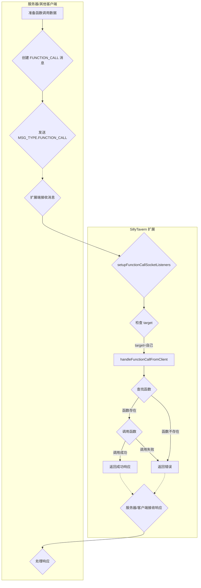

# SillyTavern-NewAge 扩展端开发文档

本文档旨在帮助开发者理解 SillyTavern-NewAge 扩展的扩展端（运行在 SillyTavern 环境中）代码结构、API 和开发流程。

## 目录

- [SillyTavern-NewAge 扩展端开发文档](#sillytavern-newage-扩展端开发文档)
  - [目录](#目录)
  - [文件结构](#文件结构)
  - [初始化流程](#初始化流程)
  - [模块和函数](#模块和函数)
  - [`index_NewAge.js`](#index_newagejs)
    - [1. 全局变量和常量](#1-全局变量和常量)
    - [2. 日志管理](#2-日志管理)
    - [3. 连接管理](#3-连接管理)
      - [3.1 Socket 管理](#31-socket-管理)
    - [4. 消息处理](#4-消息处理)
      - [4.1 LLM 请求处理](#41-llm-请求处理)
      - [4.2 函数调用处理](#42-函数调用处理)
    - [5. UI 更新](#5-ui-更新)
    - [6. 客户端密钥管理](#6-客户端密钥管理)
    - [7. 辅助函数](#7-辅助函数)
    - [8. 设置管理](#8-设置管理)
  - [`message_forwarder.js`](#message_forwarderjs)
    - [1. 消息转发](#1-消息转发)
    - [2. 辅助函数](#2-辅助函数)
  - [`Rooms.js`](#roomsjs)
  - [事件监听](#事件监听)
  - [流程图](#流程图)
    - [连接流程](#连接流程)
    - [LLM 文本生成流程](#llm-文本生成流程)
    - [Function Call 流程](#function-call-流程)
  - [开发指南](#开发指南)
  - [注意事项](#注意事项)

## 文件结构

```
SillyTavern-NewAge/ (扩展根目录)
├── dist/
│   └── iframe_server/ (前端助手代码，已复制到此)
│       ├── ...
│       └── index.js
├── lib/
│   ├── constants.js      (常量定义)
│   ├── Socket.io       (Socket.IO 客户端库)
│   ├── non_stream.js    (非流式消息处理)
│   ├── stream.js       (流式消息处理)
│   └── uuid.js          (UUID 生成)
├── index_NewAge.html     (扩展设置界面)
├── index_NewAge.js      (扩展主入口)
└── style.css         (扩展样式)
```

## 初始化流程

1. **加载 HTML 和 CSS**: SillyTavern 加载扩展的 `index_NewAge.html` 和 `style.css`。
2. **执行 JavaScript**:
    - 导入必要的模块和函数。
    - 定义全局变量。
    - 定义辅助函数。
    - 调用前端助手的所有注册函数（用于和 iframe 通信）。
    - 监听 `window` 的 `message` 事件，调用 `handleIframe` 处理来自 iframe 的消息。
    - 设置初始 UI 状态 (隐藏部分元素)。
    - 自动填充扩展识别名称和端口号。
    - 调用 `checkRememberMe()` 检查是否记住了登录。
        - 如果记住了登录，则自动调用 `connectToServer()` 连接到服务器。
        - 否则，显示连接界面（目前已强制自动连接）。
3. **连接到服务器** (自动或手动):
    - `connectToServerByHand()` (手动): 从 UI 获取服务器地址和端口。
    - `connectToServer()` (自动):
        - 获取服务器地址和端口 (从 UI 或已保存的设置中)。
        - 生成客户端 ID (`clientId`)。
        - 创建临时 `tempMainSocket`，用于和 `/auth` 通讯, 获取 `sillyTavernMasterKey`。
        - 创建主连接 `llmSocket` (连接到 `/llm` 命名空间)，并在 `auth` 对象中传递 `clientType`、`clientId`、`desc` 和 `key` (即`sillyTavernMasterKey`)。
        - 调用 `llmSocket.connect()` 连接到服务器。
        - 连接成功后：
            - 创建其他命名空间的连接 ( `authSocket`, `functionCallSocket`, `roomsSocket`, `clientsSocket`)。
            - 设置各个命名空间的事件监听器。
            - 调用 `loadSettings()` 加载设置。
            - 调用 `refreshRoomList()` 和 `updateClientList()` 更新 UI。

## 模块和函数

## `index_NewAge.js`

### 1. 全局变量和常量

| 变量名                 | 类型                                        | 描述                                                                                   |
| :--------------------- | :------------------------------------------ | :------------------------------------------------------------------------------------- |
| `extensionName`        | `string`                                    | 扩展名称 ("SillyTavern-NewAge")。                                                      |
| `extensionFolderPath`  | `string`                                    | 扩展文件夹路径。                                                                       |
| `tempMainSocket`       | `Socket`                                    | 临时的, 用于获取`sillyTavernMasterKey`                                                  |
| `llmSocket`            | `Socket`                                    | 与服务器的 LLM 连接 (主连接，`/llm` 命名空间)。                                        |
| `functionCallSocket`   | `Socket`                                    | 与服务器的 Function Call 连接 (`/function_call` 命名空间)。                          |
| `roomsSocket`          | `Socket`                                    | 与服务器的房间管理连接 (`/clients` 命名空间)。                                           |
| `clientsSocket`        | `Socket`                                    | 与服务器的客户端管理连接 (`/clients` 命名空间)。                                        |
| `authSocket`           | `Socket`                                    | 与服务器的认证连接 (`/auth` 命名空间)。                                                 |
| `logCounter`           | `number`                                    | 日志计数器。                                                                           |
| `llmRequestQueue`      | `Array<{...}>`                              | 存储待处理的 LLM 请求队列。每个请求对象包含 `generateConfig`、`requestId`、`target`、`requestType` 和 `clientMessageId`。 |
| `isProcessingRequest`  | `boolean`                                   | 标志：是否有请求正在处理中。                                                               |
| `isExpectingLLMResponse`| `boolean`                                   | 标志：是否正在等待 LLM 响应。                                                           |
| `previousLLMResponse` | `string`                                   |  存储上一个 LLM 响应的文本                                                              |
| `previousRequest`     | `object`                                  |  存储上一个请求                                                                          |
| `clientId`             | `string`                                    | 客户端 ID (例如，"SillyTavern-{port}")。                                                |
| `clientDesc`           | `string`                                    | 客户端描述。                                                                           |
| `fullServerAddress`    | `string`                                    | 服务器完整地址 (例如，"http://localhost:4000")。                                        |
| `isRemembered`         | `boolean`                                   | 是否记住了登录。                                                                       |
| `sillyTavernMasterKey` | `string`                                   |  用于存储服务器生成的`sillyTavernMasterKey`                                               |

### 2. 日志管理

| 函数名          | 描述                                               | 参数                                                                                                                                                             | 返回值 |
| :-------------- | :------------------------------------------------- | :--------------------------------------------------------------------------------------------------------------------------------------------------------------- | :----- |
| `addLogMessage` | 向日志表格添加一条日志消息。                       | `type`: 日志类型 (success, warning, fail, info)<br>`message`: 日志消息<br>`source`: 消息来源 (可选)<br>`requestId`: 请求 ID (可选)<br>`outputId`: 输出 ID (可选) | 无     |
| `filterLog`     | 根据选择的类型（或来源）过滤日志表格中的日志消息。 | 无                                                                                                                                                               | 无     |

### 3. 连接管理

| 函数名                  | 描述                                                                                                      | 参数                                                                                                                                                    | 返回值          |
| :---------------------- | :-------------------------------------------------------------------------------------------------------- | :------------------------------------------------------------------------------------------------------------------------------------------------------ | :-------------- |
| `connectToServerByHand` | 手动连接到服务器。从 UI 获取服务器地址和端口，并调用 `checkRememberMe`。                                  | 无                                                                                                                                                      | 无              |
| `connectToServer`       | 自动连接到 Socket.IO 服务器，创建 `llmSocket`，创建其他命名空间的连接，处理连接成功后的逻辑，设置监听事件。 | 无                                                                                                                                                      | `Promise<void>` |
| `disconnectAllSockets`  | 断开所有 Socket.IO 连接。                                                                                 | 无                                                                                                                                                      | 无              |
| `checkRememberMe`       | 检查是否记住了登录，如果是，则自动连接到服务器。                                                          | 无                                                                                                                                                      | `Promise<void>` |

#### 3.1 Socket 管理

| 函数名                             | 描述                                                                                                          | 参数                                                                                                                                                     | 返回值              |
| :--------------------------------- | :------------------------------------------------------------------------------------------------------------ | :------------------------------------------------------------------------------------------------------------------------------------------------------- | :------------------ |
| `createSocket`                     | 创建并配置 Socket.IO 连接，设置错误处理。                                                                       | `namespace`: 命名空间, `authData`: 认证数据, `autoConnect`: 是否自动连接 (默认为 false), `reconnection`: 是否启用自动重连, `reconnectionAttempts`: 重连次数 | `initSocket`        |
| `manageSockets`                    | 管理 Socket.IO 连接，处理断开连接和重连逻辑。                                                                  | `socketCreationFunction`: 创建 Socket 的函数 (即 `createSocket`)                                                                                        | 返回一个包含 `createSocket` 和 `cleanupAllSockets` 的对象 |
| `createNamedSocket`                | 在 `createSocket` 的基础上，给每个创建的 socket 实例设置一个变量名，方便后续访问。                              | 同 `createSocket`                                                                                                                                        | `socket`            |
| `disconnectSocket`                 | 断开指定的 Socket.IO 连接。                                                                                   | `socket`: 要断开的 Socket 实例                                                                                                                            | 无                  |
| `setupLlmSocketListeners`          | 设置 `/llm` 命名空间的 Socket.IO 事件监听器（`MSG_TYPE.LLM_REQUEST`, `MSG_TYPE.LLM_RESPONSE`)。              | 无                                                                                                                                                      | 无                  |
| `setupAuthSocketListeners`         | 设置 `/auth` 命名空间的 Socket.IO 事件监听器。                                                                 | 无                                                                                                                                                      | 无                  |
| `setupFunctionCallSocketListeners` | 设置 `/function_call` 命名空间的 Socket.IO 事件监听器 (`MSG_TYPE.FUNCTION_CALL`)。                          | 无                                                                                                                                                      | 无                  |
| `setupRoomsSocketListeners`        | 设置 `/clients` 命名空间的 Socket.IO 事件监听器 (`MSG_TYPE.GET_ROOMS`, `getClientsInRoom`)。              | 无                                                                                                                                                      | 无                  |
| `setupClientsSocketListeners`      | 设置 `/clients` 命名空间的 Socket.IO 事件监听器 (`MSG_TYPE.UPDATE_CONNECTED_CLIENTS`, `MSG_TYPE.CONNECTED_CLIENTS_UPDATE`, `MSG_TYPE.GENERATE_CLIENT_KEY`, `MSG_TYPE.REMOVE_CLIENT_KEY`, `getClientList`)。 | 无                                                                                                                                                      | 无                  |

### 4. 消息处理

#### 4.1 LLM 请求处理

| 函数名             | 描述                                                                                                  | 参数                                                                                                                                                        | 返回值          |
| :----------------- | :---------------------------------------------------------------------------------------------------- | :---------------------------------------------------------------------------------------------------------------------------------------------------------- | :-------------- |
| `handleLlmRequest` | 处理 LLM 请求。将请求添加到 `llmRequestQueue`，设置 `isExpectingLLMResponse`，并调用 `processRequest()`。 | `data`: 请求数据 (包含 `message`、`requestId`、`outputId`、`target`、`requestType`)                                                                 | `Promise<void>` |
| `processRequest`   | 按顺序处理 `llmRequestQueue` 中的请求。处理上一个 LLM 响应，调用 `iframeGenerate` 生成文本。             | 无                                                                                                                                                          | `Promise<void>` |

#### 4.2 函数调用处理

| 函数名                         | 描述                                                                                       | 参数                                                | 返回值 |
| :----------------------------- | :----------------------------------------------------------------------------------------- | :-------------------------------------------------- | :----- |
| `handleFunctionCallFromClient` | 处理来自服务器或其他客户端的函数调用请求 (仅当 `data.target` 是当前客户端 ID 时)。 | `data`: 请求数据 (包含 `requestId`、`functionName`、`args`), `callback`: 回调函数 | 无     |

### 5. UI 更新

| 函数名                                | 描述                                                | 参数                      | 返回值          |
| :------------------------------------ | :-------------------------------------------------- | :------------------------ | :-------------- |
| `updateButtonState(isConnected)`      | 更新连接/断开连接按钮的状态。                       | `isConnected`: 是否已连接 | 无              |
| `updateClientList(clients)`           | 更新客户端列表。                                    | `clients`:客户端列表      | 无              |
| `updateForwardingOptionsVisibility()` | 更新消息转发选项（流式/非流式）的可见性。           | 无                        | 无              |
| `checkAndHandleMutex()`               | 检查并处理流式/非流式转发互斥情况（不能同时启用）。 | 无                        | `boolean`       |
| `displayRoomList(rooms)`              | 将房间列表渲染到页面上。                            | `rooms`: 房间列表         | `Promise<void>` |
| `displayRoomDetails(roomName)`        | 显示房间详情 (客户端列表)。                         | `roomName`: 房间名称      | `Promise<void>` |
| `refreshRoomList()`                   | 从服务器获取房间列表并更新 UI。                     | 无                        | 无              |
| `updateDeleteRoomSelect(rooms)`        | 更新删除房间的下拉菜单。                               | `rooms`: 房间列表                   |  无              |

### 6. 客户端密钥管理

| 函数名                          | 描述                                    | 参数 | 返回值          |
| :------------------------------ | :-------------------------------------- | :--- | :-------------- |
| `initClientKeys()`              |  初始化客户端密钥                       | 无   | 无              |
| `generateAndDisplayClientKey()` | 生成并显示客户端密钥。                  | 无   | `Promise<void>` |
| `copyClientKey()`               | 将客户端密钥复制到剪贴板。              | 无   | 无              |
| `removeClientKey()`             | 移除选定客户端的密钥 (在服务器端移除)。 | 无   | 无              |

### 7. 辅助函数

| 函数名                 | 描述                            | 参数 | 返回值          |
| :--------------------- | :------------------------------ | :--- | :-------------- |
| `getSillyTavernPort()` | 获取 SillyTavern 实例的端口号。 | 无   | `string`        |
| `generateClientId()`   | 生成客户端 ID。                 | 无   | `string`        |
| `onTestClick()`           |   测试与服务器之间的连接        | 无   |  无              |

### 8. 设置管理

| 函数名           | 描述                     | 参数 | 返回值          |
| :--------------- | :----------------------- | :--- | :-------------- |
| `loadSettings()` | 从服务器加载客户端设置。 | 无   | `Promise<void>` |
| `saveSettings()` | 将客户端设置保存到服务器。 | 无   | `Promise<void>` |
|`loadNetworkSafeSetting()` | 加载网络安全设置     | 无 | `Promise<void>` |

---

## `message_forwarder.js`

### 1. 消息转发

| 函数名                       | 描述                                                                                                                                                         | 参数                                                                                                                                                         | 返回值 |
| :--------------------------- | :----------------------------------------------------------------------------------------------------------------------------------------------------------- | :----------------------------------------------------------------------------------------------------------------------------------------------------------- | :----- |
| `handleNonStreamMessage()`   | 处理非流式消息。如果启用了非流式转发，则调用 `sendNonStreamMessage` 将消息发送到服务器；如果启用了流式转发，则调用 `startStreamFromNonStream` 模拟流式发送。 | `messageId`: 消息 ID, `messageType`: 消息类型,`requestId`: 请求ID                                                                                            | 无     |
| `handleStreamToken()`        | 处理流式 token。如果启用了流式转发，则调用 `startStreamFromStream` 将 token 数据发送到服务器。                                                               | `data`: 接收到的 token 数据, `messageType`: 消息类型,`requestId`: 请求ID                                                                                     | 无     |
| `startStreamFromStream()`    | 从流式数据启动新的流式传输（用于流式转发）。为每个 token 生成一个新的 `streamId`，并将数据分割成多个块，模拟 SillyTavern 服务器的原始行为。                  | `socket`: Socket.IO Socket 实例, `newData`: 新的流数据, `outputId`: 输出 ID, `previousLength`: 之前数据的长度,`extensionName`: 扩展名称, `requestId`: 请求ID | 无     |
| `startStreamFromNonStream()` | 从非流式消息启动新的流式传输（用于非流式转发时，模拟流式行为）。                                                                                             | `socket`: Socket.IO Socket 实例, `message`: 非流式消息, `numStreams`: 分块数量,`extensionName`: 扩展名称, `requestId`: 请求ID                                | 无     |

### 2. 辅助函数

| 函数名                         | 描述                           | 参数                                                  | 返回值           |
| :----------------------------- | :----------------------------- | :---------------------------------------------------- | :--------------- |
| `getMessageType()`             | 获取消息类型（流式或非流式）。 | 无                                                    | `number`         |
| `accumulateStreamData`         | 累积流式数据。                 | `data`: 接收到的数据, `latestRequestId`: 最新的请求ID | 无               |
| `sendAccumulatedData`          | 发送累积的流式消息             | 无                                                    | 无               |
| `enableStreamForwarding()`     | 启用流式转发。                 | 无                                                    | 无               |
| `disableStreamForwarding()`    | 禁用流式转发。                 | 无                                                    | 无               |
| `enableNonStreamForwarding()`  | 启用非流式转发。               | 无                                                    | 无               |
| `disableNonStreamForwarding()` | 禁用非流式转发。               | 无                                                    | 无               |
| `getCurrentOutputId`           | 获取当前outputID               | 无                                                    | `string`或`null` |
| `setNewOutputId`               | 设置新的outputID和请求ID       | 无                                                    | 无               |
| `resetOutputId`                | 重置当前outputID和请求ID       | 无                                                    | 无               |
| `resetPreviousLLMData`         | 重置`previousLLMData`          | 无                                                    | 无               |
| `isStreamForwardingEnabled`    | 判断是否启用了流式转发         | 无                                                    | `boolean`        |
| `isNonStreamForwardingEnabled` | 判断是否启用了非流式转发       | 无                                                    | `boolean`        |

## `Rooms.js`

(注意: 此文件在扩展端和服务器端是共享的)

| 函数名                 | 描述                               | 参数                                                                | 返回值             |
| ---------------------- | :--------------------------------- | :------------------------------------------------------------------ | :----------------- |
| `createRoom`           | 创建房间（仅限扩展）。             | `extensionId`: 扩展 ID, `roomName`: 房间名称                        | `Promise<boolean>` |
| `deleteRoom`           | 删除房间（仅限扩展）。             | `extensionId`: 扩展 ID, `roomName`: 房间名称                        | `Promise<boolean>` |
| `addClientToRoom`      | 将客户端添加到房间（由扩展调用）。 | `extensionId`: 扩展 ID, `clientId`: 客户端 ID, `roomName`: 房间名称 | `Promise<boolean>` |
| `removeClientFromRoom` | 将客户端从房间移除。               | `clientId`: 客户端 ID, `roomName`: 房间名称                         | `Promise<boolean>` |
| `isClientInRoom`       | 检查客户端是否在房间内。           | `clientId`: 客户端ID, `roomName`: 房间名称                          | `boolean`          |
| `setClientDescription` | 设置客户端描述。                   | `clientId`: 客户端 ID, `description`: 描述                          | 无                 |
| `getClientDescription` | 获取客户端描述。                   | `clientId`: 客户端 ID                                               | `string` \| `null` |
| `getAllRooms`          | 获取服务器中所有的房间             | 无                                                                  | `string[]`         |

## 事件监听

- **SillyTavern 事件 ( `eventSource.on(...)` ):**
  - `event_types.STREAM_TOKEN_RECEIVED`: 监听流式 token。
  - `event_types.MESSAGE_RECEIVED`: 监听新消息 (完整消息，非流式)。
  - `event_types.GENERATION_STARTED`: 监听生成开始事件。
  - `event_types.GENERATION_ENDED`: 监听生成结束事件。
  - `event_types.GENERATION_STOPPED`: 监听生成停止事件。
  - `'js_generation_ended'`: 监听生成结束事件 (来自前端助手)。

- **Socket.IO 事件 ( `socket.on(...)` ):**

  - **通用事件：**
    - `connect`: 监听连接建立事件。
    - `connect_error`: 监听连接错误事件。
    - `disconnect`: 监听断开连接事件。
    - `error`: 监听一般错误事件。
  - **`/llm` 命名空间:**
    - `MSG_TYPE.LLM_REQUEST`: 监听 LLM 请求 (服务器 -> 客户端, 通常不会用到, 因为客户端会直接调用`iframeGenerate()`).
    - `MSG_TYPE.LLM_RESPONSE`: 监听 LLM 响应 (服务器 -> 客户端)。
  - **`/auth` 命名空间:** 无 (已弃用)
  - **`/function_call` 命名空间:**
    - `MSG_TYPE.FUNCTION_CALL`: 监听函数调用请求 (服务器 -> 客户端)。
  - **`/clients` 命名空间:**
    - `MSG_TYPE.GET_ROOMS`: 监听获取房间列表的请求 (服务器 -> 客户端)。
    - `getClientsInRoom`: 监听获取房间内客户端列表的请求 (服务器 -> 客户端)。
    - `MSG_TYPE.GENERATE_CLIENT_KEY`: 监听生成客户端密钥请求 (服务器 -> 客户端)。
    - `MSG_TYPE.REMOVE_CLIENT_KEY`: 监听移除客户端密钥请求 (服务器 -> 客户端).
    - `getClientList`: 监听获取客户端列表请求.
    - `MSG_TYPE.UPDATE_CONNECTED_CLIENTS`:  获取初始的已连接客户端列表。
    - `MSG_TYPE.CONNECTED_CLIENTS_UPDATE`: 监听客户端列表更新。

- **UI 事件 (jQuery):**

  - `$('#ST-NewAge-socketio-connectBtn').on('click', ...)`: 手动连接按钮。
  - `$('#ST-NewAge-socketio-testBtn').on('click', ...)`: 测试连接按钮。
  - `$('#ST-NewAge-socketio-saveSettingsBtn').on('click', ...)`: 保存设置按钮。
  - `$('#ST-NewAge-socketio-logFilter').on('change', ...)`: 日志过滤器。
  - `$('#ST-NewAge-socketio-refreshRoomsBtn').on('click', ...)`: 刷新房间列表按钮。
  - `$('#ST-NewAge-socketio-generateKeyBtn').on('click', ...)`: 生成密钥按钮。
  - `$('#ST-NewAge-socketio-copyKeyBtn').on('click', ...)`: 复制密钥按钮。
  - `$('#ST-NewAge-socketio-removeKeyBtn').on('click', ...)`: 移除密钥按钮。
  - `$('#ST-NewAge-socketio-defaultForwarding').on('change', ...)`: 默认转发行为复选框。
  - `$('#stream_toggle').on('change', ...)`: 流式传输开关 (SillyTavern 原生)。
  - `$('#ST-NewAge-socketio-enableStream').on('change', ...)`: 启用流式转发复选框。
  - `$('#ST-NewAge-socketio-enableNonStream').on('change', ...)`: 启用非流式转发复选框。
  - 次级菜单相关:
    - `$('.ST-NewAge-operation-btn').on('click', ...)`: 房间操作按钮。
    - `$('.ST-NewAge-room-submenu .ST-NewAge-details-btn').on('click', ...)`: 房间详情按钮。
    - `$('.ST-NewAge-room-submenu .ST-NewAge-leave-btn').on('click', ...)`: 离开/踢出房间按钮。
    - `$('.ST-NewAge-room-submenu .ST-NewAge-join-btn').on('click', ...)`: 加入房间按钮。

- **`window` 事件:**

  - `message`: 监听来自 iframe 的消息 (用于与前端助手集成)。

## 流程图

### 连接流程

```mermaid
graph TD
    subgraph 客户端 (SillyTavern 扩展)
        A[页面加载] --> B{检查是否记住登录}
        B -- 是 --> C[自动 connectToServer]
        B -- 否 --> D[显示连接界面]
        D --> E[用户输入服务器地址/端口]
        E --> F[点击连接按钮 (connectToServerByHand)]
        F --> C
        C --> G{创建 tempMainSocket}
        G --> H{发送 MSG_TYPE.IDENTIFY_SILLYTAVERN}
        H -.-> I{接收响应}
        I --> J{获取 sillyTavernMasterKey}
        J --> K[创建 llmSocket (主连接)]
        K --> L{设置 authData (包含 key)}
        L --> M{llmSocket.connect()}
        M --> N[连接成功]
        N --> O{创建其他命名空间连接}
        O --> P{设置事件监听器}
        P --> Q{加载设置}
        Q --> R{刷新 UI}
    end

    subgraph 服务器
        H -.-> S{验证 SillyTavern 客户端}
        S -- 成功 --> T[返回 sillyTavernMasterKey]
        M -.-> U{验证客户端}
        U -- 成功 --> V[接受连接]
    end
```

### LLM 文本生成流程

```mermaid
graph TD
    subgraph SillyTavern 扩展
        A[用户输入/触发生成] --> B{handleLlmRequest}
        B --> C{添加到 llmRequestQueue}
        C --> D{processRequest}
        D --> E{调用 iframeGenerate (前端助手)}
    end

    subgraph 前端助手
        E --> F{生成文本}
        F --> G[触发 SillyTavern 事件]
        G -- STREAM_TOKEN_RECEIVED --> H{handleStreamToken (message_forwarder)}
        G -- MESSAGE_RECEIVED --> I{handleNonStreamMessage (message_forwarder)}
    end

    subgraph SillyTavern 扩展
        H --> J{startStreamFromStream}
        J --> K{发送流式事件到服务器}
        I --> L{startStreamFromNonStream 或 sendNonStreamMessage}
        L --> M{发送消息到服务器}
        subgraph 事件监听
          N[generation_ended] --> O{获取完整消息, 更新UI}
        end

    end

    subgraph 服务器
        K -.-> P{服务器处理流式数据}
        M -.-> Q{服务器处理消息}
    end
```

### Function Call 流程



## 开发指南

1. **连接管理：**

    - 使用 `createSocket()` 创建 Socket.IO 连接。
    - 使用 `manageSockets` 自动管理 Socket 的生命周期。
    - 使用 `disconnectAllSockets()` 断开所有连接。
    - 监听 `connect`、`connect_error`、`disconnect` 和 `error` 事件来处理连接状态的变化。

2. **消息格式：**

    - 客户端/SillyTavern扩展端和服务器之间的所有消息都应该遵循以下基本格式：

        ```json
        {
          "type": "消息类型 (参考 MSG_TYPE)",
          "requestId": "唯一请求 ID",
          "source": "消息来源 ('server' 或客户端 ID)",
          "...": "其他数据 (根据消息类型而定)"
        }
        ```

3. **LLM 请求：**

    - 当服务器发送 `MSG_TYPE.LLM_REQUEST` 时，`handleLlmRequest` 会被调用。
    - `handleLlmRequest` 将请求添加到 `llmRequestQueue`，并调用 `processRequest`。
    - `processRequest` 按顺序处理请求，调用 `iframeGenerate` 生成文本（通过前端助手）。
    - 监听 `MSG_TYPE.ERROR` 事件来处理错误。

4. **流式/非流式转发：**

    - 使用 `message_forwarder.enableStreamForwarding()` 和 `message_forwarder.disableStreamForwarding()` 来启用/禁用流式转发。
    - 使用 `message_forwarder.enableNonStreamForwarding()` 和 `message_forwarder.disableNonStreamForwarding()` 来启用/禁用非流式转发。
    - SillyTavern 的 `STREAM_TOKEN_RECEIVED` 事件触发 `message_forwarder.handleStreamToken()`。
    - SillyTavern 的 `MESSAGE_RECEIVED` 事件触发 `message_forwarder.handleNonStreamMessage()`。

5. **Function Calling：**

    - 服务器或其他客户端可以向扩展端发送 `MSG_TYPE.FUNCTION_CALL` 消息来调用扩展端的函数。
    - `setupFunctionCallSocketListeners` 监听 `MSG_TYPE.FUNCTION_CALL` 消息。
    - 如果 `data.target` 是当前客户端 ID，则 `handleFunctionCallFromClient` 会被调用。
    - 在 `handleFunctionCallFromClient` 中实现函数调用的逻辑。

6. **房间管理：**

    - 使用 `Rooms.js` 中的函数 ( `addClientToRoom`, `removeClientFromRoom` ) 来管理客户端的房间。
    - 使用 `refreshRoomList()` 刷新房间列表。
    - 监听 `getClientsInRoom` 事件来获取房间内的客户端列表。

7. **客户端密钥管理：**

    - 调用 `generateAndDisplayClientKey` 生成并显示。
    - 调用 `copyClientKey` 复制。
    - 调用 `removeClientKey` 删除。

8. **错误处理：**

    - 在事件监听器中，使用 `try...catch` 块来捕获错误。
    - 向客户端发送错误消息时，使用 `MSG_TYPE.ERROR` 类型。

9. **异步操作：** 注意 `async/await` 和 `Promise` 的使用。

## 注意事项

- 扩展端运行在 SillyTavern 的 iframe 中，和 SillyTavern 主程序同源。
- 扩展端的大部分函数都不是全局函数，需要通过 `import` 的方式进行调用。
- 扩展端可以通过 SillyTavern 提供的一些变量和 event 来进行操作，具体请参考 SillyTavern 的文档。
- 注意异步操作，比如 `socket.emit` 的回调，以及 `Promise`。
- 注意 `message_forwarder.js` 的消息转发机制（流式和非流式）。
- 注意 `index_NewAge.js` 的 `llmRequestQueue` 和 `processRequest` 请求队列。
- 注意房间的概念，以及 SillyTavern 扩展的权限。
- 注意错误处理，特别是和服务器的通信。
- 注意 `socket.handshake.auth` 中的内容（`clientId`, `clientType`, `desc`, `key`）。
- 注意 `setup...SocketListeners()` 中的事件监听，确保理解每个事件的触发时机和数据格式。
- 注意安全性，尤其是密钥的处理。
- 注意代码的可读性和可维护性，遵循模块化的原则。
- UI 相关的操作，使用 jQuery。

希望这份开发文档能够帮助你更好地理解和使用 SillyTavern-NewAge 扩展！
--- END OF FILE developer_readme_extension.md ---
